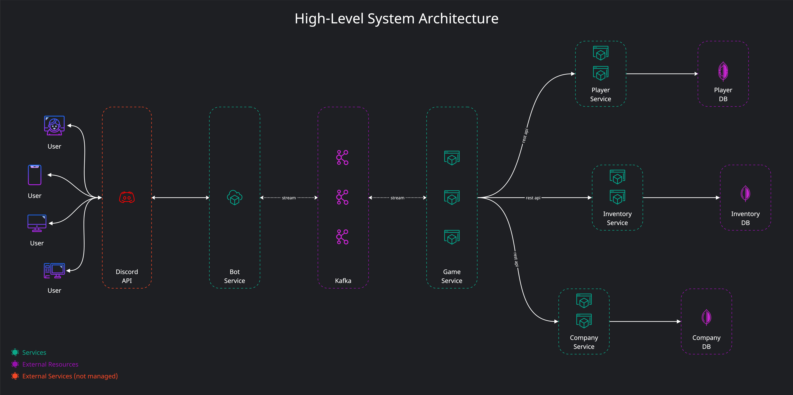
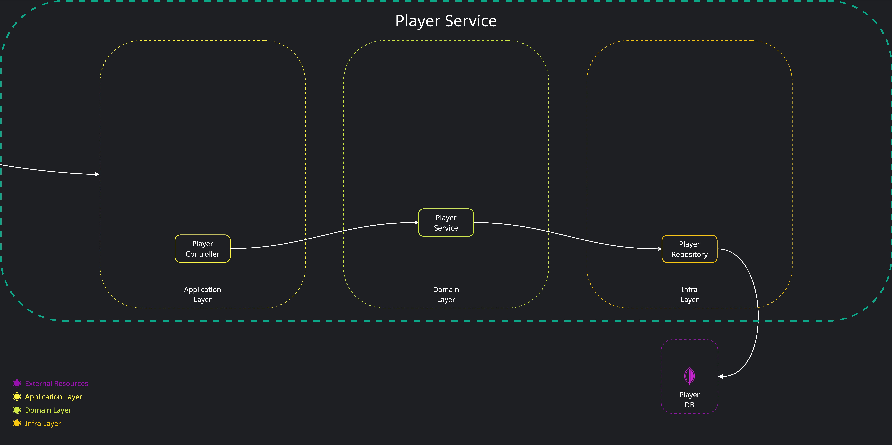

# Changelog

All notable changes to this project will be documented in this file.

The format is based on [Keep a Changelog](https://keepachangelog.com/en/1.0.0/),
and this project adheres to [Semantic Versioning](https://semver.org/spec/v2.0.0.html).

___

## 0.1 - WIP

> ### `Documentation`
> 

>   
Added high level system design diagram

>   
> 

> 

>   
Added player-service design diagram

>   
> 

> ### `Initial Setup`
> [Adding dependencies and plugins for the project](gradle/libs.versions.toml)
>
> - [x] 💜 `Kotlin` latest version
> - [x] `Kotest` library for the best Kotlin test framework
> - [x] `Detekt` plugin for Code Quality
> - [x] `Spotless` plugin for Code Quality
> - [x] `Sonarqube` plugin for Code Coverage
> - [x] `ArchUnit` for Architecture tests
> - [x] `TestContainers` for Integration tests
> - [ ] `Dokka` plugin for generating KDoc documentation
> - [ ] `Kotlinx` for concurrency
